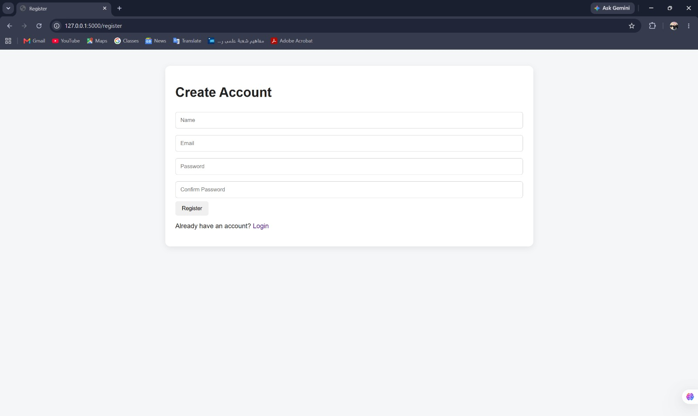
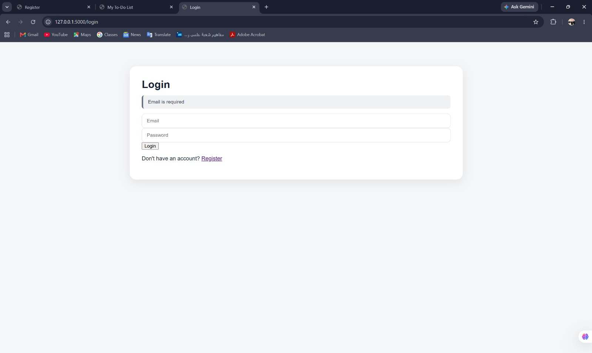
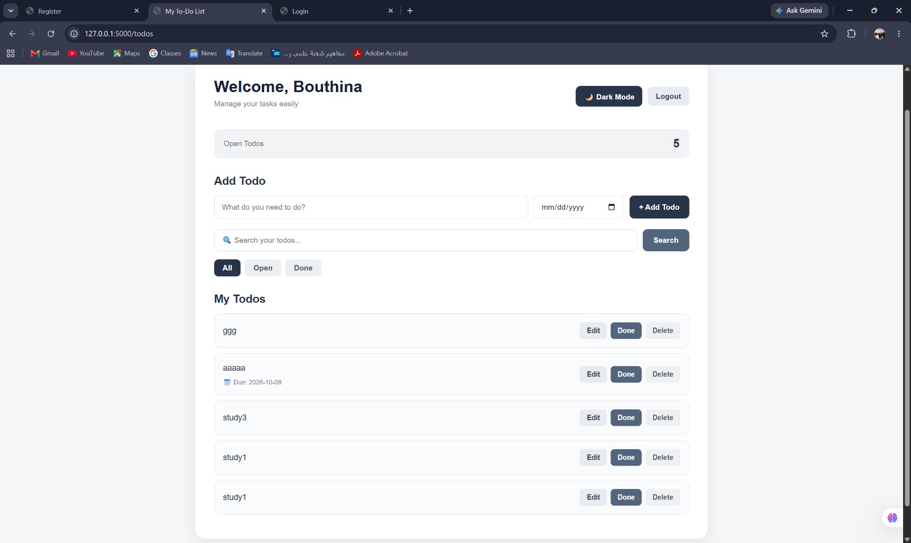
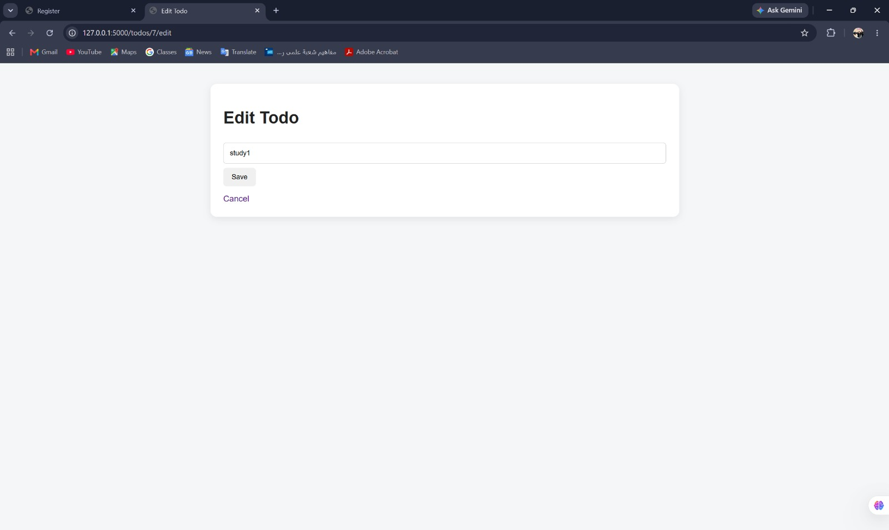

# Login & To-Do Application

## Team Members

- Bouthina Mohamed Abdelwahab
- Student ID: 2304065

## Project Overview

A simple web-based Login and To-Do application built for the Database Systems Lab.

The application allows users to:

- Create an account
- Login and logout
- Add todos
- Edit todos
- Mark todos as done or undone
- Delete todos
- View only their own todos

## Tech Stack

- Python
- Flask
- MySQL
- PyMySQL
- HTML
- CSS
- JavaScript
- bcrypt
- python-dotenv
## Screenshots

### Registration Page



### Login Page



### Todo List



### Edit Todo



## Lab Questions & Answers

### (a) Why do UPDATE and DELETE contain `AND user_id = %s`, and what changes if you remove it?

The `UPDATE` and `DELETE` queries contain:

```sql
AND user_id = %s
```

to make sure that the logged-in user can only modify or delete their own todos.

For example:

```sql
UPDATE todos
SET title = %s
WHERE todo_id = %s AND user_id = %s;
```

and:

```sql
DELETE FROM todos
WHERE todo_id = %s AND user_id = %s;
```

The `user_id` comes from the current user's session.

This provides an authorization check. It ensures that the todo belongs to the currently logged-in user before allowing the operation.

If we remove `AND user_id = %s`, the database will only check the `todo_id`. Therefore, a user could potentially modify or delete another user's todo if they know or guess its `todo_id`.

---

### (b) What happens if you insert a to-do for a user that does not exist, and which constraint is that?

The `todos` table uses a Foreign Key:

```sql
FOREIGN KEY (user_id) REFERENCES users(user_id)
```

This means that a `user_id` stored in the `todos` table must already exist in the `users` table.

If we try to insert a todo for a user that does not exist, the database rejects the operation and returns a foreign key constraint error.

This is an example of **Referential Integrity**, enforced by the **Foreign Key constraint**.

---

### (c) Why do you store a hash and not the password?

The application stores a password hash instead of the original password for security.

The password is hashed using `bcrypt` before it is stored in the database.

For example:

```text
Original password:
mypassword123

Stored value:
bcrypt hash
```

This protects users' passwords if the database is compromised.

During login, `bcrypt` is used to check whether the entered password matches the stored hash without storing the original password.

Therefore, storing a hash is safer than storing passwords as plain text.

---

### (d) The `name` column is `NOT NULL`: why did you still need your own check for an empty name?

`NOT NULL` only prevents the database from storing a `NULL` value.

It does not prevent an empty string:

```text
""
```

or a name containing only spaces.

The application therefore performs its own validation:

```python
name = request.form.get("name", "").strip()

if not name:
    # Reject empty name
```

For example, if the user enters only spaces:

```text
"     "
```

the `.strip()` function converts it to:

```text
""
```

and the application rejects it.

Therefore:

* `NOT NULL` protects the database from `NULL` values.
* Application validation prevents empty or whitespace-only names.

Both checks are useful because they protect the data at different levels.

## Database

The application uses a MySQL database called `registration`.

It contains two tables:

- `users`
- `todos`

The relationship between the tables is implemented using a Foreign Key:

```sql
FOREIGN KEY (user_id) REFERENCES users(user_id)
